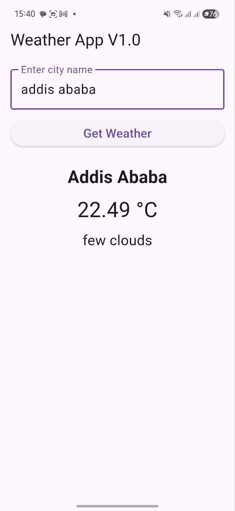
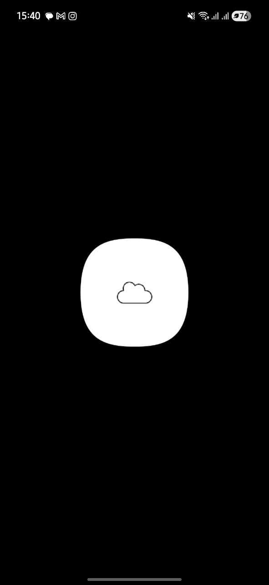

# Weather-App
this is the first flutter app i made  as my fisrt step in my flutter development journey 
ive used public api from https://openweathermap.org/

And make it simple display of wether parameters with city,temprature and wheter info

the icon is from :https://www.freepik.com/vectors/cloud-symbol

  
  

and use